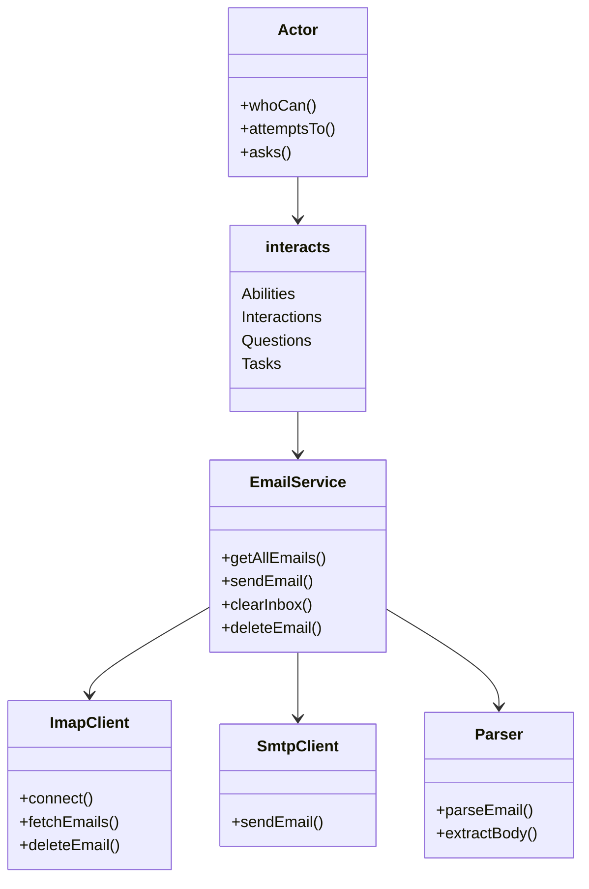

## Table of Contents
- [Gmail IMAP API Automation Project](#gmail-imap-api-automation-project)
  - [Project Structure](#project-structure)
    - [Directory Overview](#directory-overview)
  - [Class Diagram](#class-diagram)
  - [Dependencies](#dependencies)
  - [Setup and Installation](#setup-and-installation)


# Gmail IMAP API Automation Project

This project is an automated testing setup using the Screenplay pattern integrated with Playwright, focusing on email management using IMAP. It demonstrates how to handle email operations such as sending, receiving, verifying, and deleting emails using structured tasks, questions, and abilities.

## Project Structure

The project is divided into two main parts:
1. **Screenplay Pattern** - Implements the Screenplay pattern with actors, abilities, tasks, questions, and interactions.
2. **Email Infrastructure** - Handles the email operations using IMAP and SMTP protocols.

### Directory Overview
```
/infra/email/
  - emailService.js          # Main service to handle email operations
  - env.js                   # Email related env variable loader
  - imapClient.js            # Handles IMAP operations for email fetching and deletion
  - parser.js                # Parses email content
  - smtpClient.js            # Handles sending emails via SMTP

/screenplay/
  - abilities/               # Abilities that actors can perform (e.g., manageEmails)
  - actors/                  # Actor setup for the Screenplay pattern
  - config/                  # Configuration files for loading environment variables
  - data/                    # User data for testing
  - interactions/            # Interactions between actors and the system
  - questions/               # Questions to verify conditions in the system
  - tasks/                   # Tasks that actors perform in the system

/tests/
  - email.spec.js            # Integration tests using Playwright and Screenplay pattern
```
## Class Diagram

The following diagram illustrates the relationships between the components in the Screenplay pattern and the email infrastructure



## Dependencies

The project relies on the following key dependencies:
- **Playwright**: For browser automation and testing.
- **Node IMAP**: To interact with the IMAP server.
- **Nodemailer**: For sending emails via SMTP.
- **dotenv**: For environment variable management.

## Setup and Installation

1. **Clone the Repository**
   ```bash
   git clone https://github.com/betoth/gmail-imap-api.git
   cd gmail-imap-api
   ```

2. **Install Dependencies**
   ```bash
   npm install
   ```

3. **Configure Environment Variables**
   Create a `.env` file in the root directory with the following content:
   ```env
   ADMIN_EMAIL=your-email@gmail.com
   ADMIN_PASSWORD=your-email-password
   ```

4. **Run Tests**
   ```bash
   npm test
   ```

